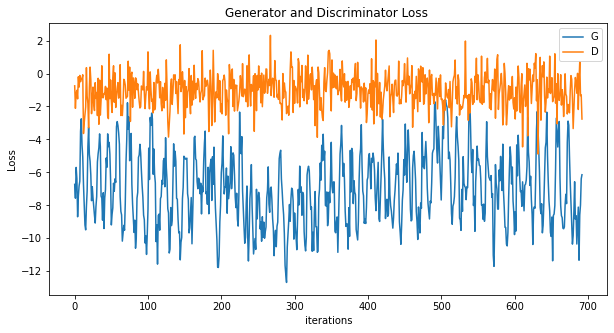

# WGAN-GP Implementation

This repository contains an implementation of a Wasserstein Generative Adversarial Network with Gradient Penalty (WGAN-GP) for generating images, specifically trained on the MNIST dataset.

## Project Overview

The main objective of this project is to implement and train a WGAN-GP model. The WGAN-GP is an improvement over the original GAN, with a focus on improving the stability of the training process and mitigating issues like mode collapse.

## Dataset

The model is trained on the [MNIST dataset](http://yann.lecun.com/exdb/mnist/), which consists of 28x28 grayscale images of handwritten digits. The dataset is automatically downloaded and preprocessed in this code.

## Model Architecture

### Generator

The generator network takes a random noise vector as input and produces a 28x28 image. The network consists of:

- Fully connected layers with spectral normalization.
- Transposed convolutional layers (also known as deconvolutional layers) to upsample the noise vector into a full-sized image.
- LeakyReLU activations and a final Tanh activation function.

### Discriminator

The discriminator network attempts to distinguish between real images from the dataset and fake images generated by the generator. The network consists of:

- Convolutional layers with spectral normalization.
- LeakyReLU activations.
- Dropout layers for regularization.
- A final fully connected layer that outputs a single scalar value representing the "realness" of the input image.

### Loss Function

The WGAN-GP loss function includes a gradient penalty term to enforce the Lipschitz constraint, which is critical for the stability of training. The loss is calculated as follows:

- **Discriminator loss**: `D_loss = fake_score - real_score + λ * gradient_penalty`
- **Generator loss**: `G_loss = -torch.mean(fake_score)`

## Training

The model is trained for 25 epochs using the Adam optimizer with learning rates of `0.0003` for the generator and `0.0002` for the discriminator. During training, the discriminator is updated 5 times for every generator update.

### Loss Graph

The following graph shows the generator and discriminator loss over the training iterations:



- **Generator Loss (G_loss)**: Measures how well the generator is producing images that can fool the discriminator. A lower G_loss indicates better performance.
- **Discriminator Loss (D_loss)**: Measures how well the discriminator is distinguishing between real and fake images. The goal is to balance the G_loss and D_loss to ensure that neither the generator nor the discriminator dominates the training process.

The periodic spikes in loss may indicate the generator learning new features to fool the discriminator, causing temporary instability. However, these spikes should become less frequent as training progresses.

## Results

After training, the generator is capable of producing images that resemble handwritten digits from the MNIST dataset. Below is a sample of generated images:


## Usage

### Prerequisites

- Python 3.x
- PyTorch
- torchvision
- matplotlib
- numpy

### How to Run

1. Clone this repository:
   ```bash
   git clone https://github.com/yourusername/WGAN-GP.git
   cd WGAN-GP
